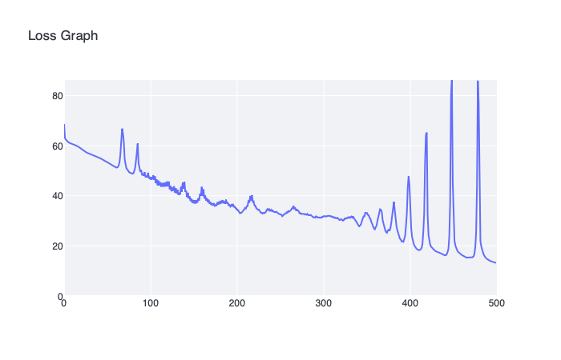

[](https://classroom.github.com/a/YFgwt0yY)
# MiniTorch Module 2


* Docs: https://minitorch.github.io/

* Overview: https://minitorch.github.io/module2/module2/

This assignment requires the following files from the previous assignments. You can get these by running

```bash
python sync_previous_module.py previous-module-dir current-module-dir
```

The files that will be synced are:

        minitorch/operators.py minitorch/module.py minitorch/autodiff.py minitorch/scalar.py minitorch/scalar_functions.py minitorch/module.py project/run_manual.py project/run_scalar.py project/datasets.py


# Task 2.5

## Simple Model

Parameters:

    PTS = 50
    DATASET = minitorch.datasets["Simple"](PTS)
    HIDDEN = 2
    RATE = 0.1

Log:

    Epoch: 0/500, loss: 0, correct: 0
    Epoch: 10/500, loss: 38.12209166735212, correct: 26
    Epoch: 20/500, loss: 34.88878833178907, correct: 26
    Epoch: 30/500, loss: 34.11108253785179, correct: 26
    Epoch: 40/500, loss: 33.7820357670027, correct: 26
    Epoch: 50/500, loss: 33.549431716182674, correct: 35
    Epoch: 60/500, loss: 33.31735821569667, correct: 38
    Epoch: 70/500, loss: 33.03157691535862, correct: 42
    Epoch: 80/500, loss: 32.675470388831926, correct: 42
    Epoch: 90/500, loss: 32.22617010389722, correct: 44
    Epoch: 100/500, loss: 31.652093250719187, correct: 46
    Epoch: 110/500, loss: 30.91570659169051, correct: 48
    Epoch: 120/500, loss: 29.978553198867502, correct: 49
    Epoch: 130/500, loss: 28.78141235785034, correct: 48
    Epoch: 140/500, loss: 27.27819751329655, correct: 48
    Epoch: 150/500, loss: 25.44175815018471, correct: 48
    Epoch: 160/500, loss: 23.290191581151852, correct: 48
    Epoch: 170/500, loss: 20.910187818899296, correct: 48
    Epoch: 180/500, loss: 18.45637775639145, correct: 48
    Epoch: 190/500, loss: 16.125323714106237, correct: 48
    Epoch: 200/500, loss: 14.063500930483512, correct: 48
    Epoch: 210/500, loss: 12.3249752167202, correct: 48
    Epoch: 220/500, loss: 10.913125275490238, correct: 48
    Epoch: 230/500, loss: 9.77323234621551, correct: 49
    Epoch: 240/500, loss: 8.85167064583964, correct: 49
    Epoch: 250/500, loss: 8.100172573435332, correct: 49
    Epoch: 260/500, loss: 7.479625280061897, correct: 49
    Epoch: 270/500, loss: 6.960013680134409, correct: 49
    Epoch: 280/500, loss: 6.518849912337185, correct: 49
    Epoch: 290/500, loss: 6.139397856144395, correct: 49
    Epoch: 300/500, loss: 5.809360993009938, correct: 49
    Epoch: 310/500, loss: 5.519065405499645, correct: 49
    Epoch: 320/500, loss: 5.2612733251391814, correct: 49
    Epoch: 330/500, loss: 5.03162614614557, correct: 49
    Epoch: 340/500, loss: 4.824548414766569, correct: 49
    Epoch: 350/500, loss: 4.6362239659844215, correct: 49
    Epoch: 360/500, loss: 4.463989260485037, correct: 49
    Epoch: 370/500, loss: 4.305701010291979, correct: 49
    Epoch: 380/500, loss: 4.159543288248085, correct: 49
    Epoch: 390/500, loss: 4.023988139764256, correct: 49
    Epoch: 400/500, loss: 3.898005900447843, correct: 49
    Epoch: 410/500, loss: 3.7806642923070553, correct: 49
    Epoch: 420/500, loss: 3.6705365197134925, correct: 49
    Epoch: 430/500, loss: 3.566890827273657, correct: 49
    Epoch: 440/500, loss: 3.469095384336409, correct: 49
    Epoch: 450/500, loss: 3.376601878904198, correct: 49
    Epoch: 460/500, loss: 3.288966656959813, correct: 49
    Epoch: 470/500, loss: 3.205733384812812, correct: 49
    Epoch: 480/500, loss: 3.1265443664113106, correct: 49
    Epoch: 490/500, loss: 3.0511105878967286, correct: 49
    Epoch: 500/500, loss: 2.979098462041428, correct: 49

Images:


## Diag Model

Parameters:

    PTS = 50
    DATASET = minitorch.datasets["Diag"](PTS)
    HIDDEN = 2
    RATE = 1.0

Log:

    Epoch: 0/500, loss: 0, correct: 0
    Epoch: 10/500, loss: 17.524073861847732, correct: 44
    Epoch: 20/500, loss: 15.696006601453112, correct: 44
    Epoch: 30/500, loss: 11.732871914311529, correct: 44
    Epoch: 40/500, loss: 8.222607985547986, correct: 44
    Epoch: 50/500, loss: 6.007103648179584, correct: 44
    Epoch: 60/500, loss: 4.6651731511789, correct: 49
    Epoch: 70/500, loss: 3.7034551107265083, correct: 49
    Epoch: 80/500, loss: 3.010700589296395, correct: 49
    Epoch: 90/500, loss: 2.499211692133039, correct: 50
    Epoch: 100/500, loss: 2.113091494025533, correct: 50
    Epoch: 110/500, loss: 1.81513706236588, correct: 50
    Epoch: 120/500, loss: 1.5854139323858027, correct: 50
    Epoch: 130/500, loss: 1.4045465181377648, correct: 50
    Epoch: 140/500, loss: 1.2582469711441828, correct: 50
    Epoch: 150/500, loss: 1.137554940100122, correct: 50
    Epoch: 160/500, loss: 1.0363354701434562, correct: 50
    Epoch: 170/500, loss: 0.9501047626646083, correct: 50
    Epoch: 180/500, loss: 0.8757090506297112, correct: 50
    Epoch: 190/500, loss: 0.8108595732094539, correct: 50
    Epoch: 200/500, loss: 0.753847326853679, correct: 50
    Epoch: 210/500, loss: 0.7033637063488287, correct: 50
    Epoch: 220/500, loss: 0.6583846755544567, correct: 50
    Epoch: 230/500, loss: 0.6180938976009963, correct: 50
    Epoch: 240/500, loss: 0.5818303257080346, correct: 50
    Epoch: 250/500, loss: 0.5490515285232092, correct: 50
    Epoch: 260/500, loss: 0.5193073874295258, correct: 50
    Epoch: 270/500, loss: 0.4922207987800624, correct: 50
    Epoch: 280/500, loss: 0.46747322031097255, correct: 50
    Epoch: 290/500, loss: 0.4447936442690261, correct: 50
    Epoch: 300/500, loss: 0.42395004676880504, correct: 50
    Epoch: 310/500, loss: 0.4047426621216003, correct: 50
    Epoch: 320/500, loss: 0.38699862647275385, correct: 50
    Epoch: 330/500, loss: 0.3705676655177725, correct: 50
    Epoch: 340/500, loss: 0.3553185897876736, correct: 50
    Epoch: 350/500, loss: 0.3411364225204454, correct: 50
    Epoch: 360/500, loss: 0.3279200286058867, correct: 50
    Epoch: 370/500, loss: 0.31558014435163406, correct: 50
    Epoch: 380/500, loss: 0.30403773067245116, correct: 50
    Epoch: 390/500, loss: 0.29322258926975525, correct: 50
    Epoch: 400/500, loss: 0.2830721941377192, correct: 50
    Epoch: 410/500, loss: 0.2735307004654533, correct: 50
    Epoch: 420/500, loss: 0.26454810050821825, correct: 50
    Epoch: 430/500, loss: 0.2560795018442206, correct: 50
    Epoch: 440/500, loss: 0.2480845080262821, correct: 50
    Epoch: 450/500, loss: 0.24052668527688367, correct: 50
    Epoch: 460/500, loss: 0.23337310178023657, correct: 50
    Epoch: 470/500, loss: 0.22659392845952828, correct: 50
    Epoch: 480/500, loss: 0.22016209201499518, correct: 50
    Epoch: 490/500, loss: 0.21405297253294964, correct: 50
    Epoch: 500/500, loss: 0.20824413922973256, correct: 50

Images:


## Split Model

Parameters:

    PTS = 90
    DATASET = minitorch.datasets["Split"](PTS)
    HIDDEN = 4
    RATE = 0.5

Log:

    Epoch: 0/500, loss: 0, correct: 0
    Epoch: 10/500, loss: 62.03971387900899, correct: 42
    Epoch: 20/500, loss: 61.95688039316598, correct: 40
    Epoch: 30/500, loss: 61.867672215749195, correct: 40
    Epoch: 40/500, loss: 61.77073645117813, correct: 39
    Epoch: 50/500, loss: 61.666684118495, correct: 39
    Epoch: 60/500, loss: 61.558274104241185, correct: 39
    Epoch: 70/500, loss: 61.450032432325266, correct: 40
    Epoch: 80/500, loss: 61.3471913470044, correct: 42
    Epoch: 90/500, loss: 61.258189013599356, correct: 43
    Epoch: 100/500, loss: 60.66966739580274, correct: 49
    Epoch: 110/500, loss: 58.24535472094628, correct: 56
    Epoch: 120/500, loss: 56.09630730769044, correct: 61
    Epoch: 130/500, loss: 53.29076455520622, correct: 64
    Epoch: 140/500, loss: 50.98898807972223, correct: 60
    Epoch: 150/500, loss: 49.066911504669996, correct: 61
    Epoch: 160/500, loss: 45.8262293040559, correct: 65
    Epoch: 170/500, loss: 41.99179513228806, correct: 67
    Epoch: 180/500, loss: 38.317630071714774, correct: 67
    Epoch: 190/500, loss: 69.72293159943055, correct: 56
    Epoch: 200/500, loss: 29.208905521751642, correct: 80
    Epoch: 210/500, loss: 27.45176492096281, correct: 82
    Epoch: 220/500, loss: 24.902700935928898, correct: 83
    Epoch: 230/500, loss: 18.90118694889453, correct: 84
    Epoch: 240/500, loss: 16.290392780896248, correct: 84
    Epoch: 250/500, loss: 19.582762670383286, correct: 83
    Epoch: 260/500, loss: 31.424327816762812, correct: 86
    Epoch: 270/500, loss: 19.263386423378705, correct: 85
    Epoch: 280/500, loss: 13.183776319979831, correct: 87
    Epoch: 290/500, loss: 12.531231141263282, correct: 86
    Epoch: 300/500, loss: 29.984007683552964, correct: 77
    Epoch: 310/500, loss: 23.105127461780732, correct: 79
    Epoch: 320/500, loss: 21.60400201602721, correct: 81
    Epoch: 330/500, loss: 20.788512657020803, correct: 81
    Epoch: 340/500, loss: 21.091553216796193, correct: 81
    Epoch: 350/500, loss: 19.453839988445484, correct: 81
    Epoch: 360/500, loss: 17.029442457596588, correct: 82
    Epoch: 370/500, loss: 16.638075909160754, correct: 82
    Epoch: 380/500, loss: 16.522875527179373, correct: 82
    Epoch: 390/500, loss: 16.13635701645307, correct: 82
    Epoch: 400/500, loss: 15.308114663414326, correct: 82
    Epoch: 410/500, loss: 15.025091899713257, correct: 82
    Epoch: 420/500, loss: 14.843649801737953, correct: 82
    Epoch: 430/500, loss: 14.432573854087074, correct: 82
    Epoch: 440/500, loss: 14.113155279178963, correct: 82
    Epoch: 450/500, loss: 13.979699618209455, correct: 82
    Epoch: 460/500, loss: 13.801068057950117, correct: 82
    Epoch: 470/500, loss: 13.533048896250138, correct: 82
    Epoch: 480/500, loss: 13.303301933517433, correct: 82
    Epoch: 490/500, loss: 13.0986263167392, correct: 82
    Epoch: 500/500, loss: 13.01130668744701, correct: 82

Images:


## Xor Model

Note that at this point, I switched to using RParam instead of my original, which just called rand() and did not recenter the mean. This seems to do much better.

Parameters:

    PTS = 90
    DATASET = minitorch.datasets["Xor"](PTS)
    HIDDEN = 8
    RATE = 0.5

Log:

    Epoch: 0/500, loss: 0, correct: 0
    Epoch: 10/500, loss: 60.666510891515216, correct: 55
    Epoch: 20/500, loss: 58.919450256363646, correct: 55
    Epoch: 30/500, loss: 56.87044942927245, correct: 55
    Epoch: 40/500, loss: 55.44319779328784, correct: 55
    Epoch: 50/500, loss: 53.63411378725782, correct: 55
    Epoch: 60/500, loss: 51.488446924166794, correct: 63
    Epoch: 70/500, loss: 61.408534630377446, correct: 45
    Epoch: 80/500, loss: 48.91109802030681, correct: 74
    Epoch: 90/500, loss: 50.30223016784453, correct: 67
    Epoch: 100/500, loss: 47.57993214470271, correct: 66
    Epoch: 110/500, loss: 46.06846633379323, correct: 65
    Epoch: 120/500, loss: 45.727304048157514, correct: 64
    Epoch: 130/500, loss: 43.053838253323484, correct: 67
    Epoch: 140/500, loss: 45.58842579983267, correct: 66
    Epoch: 150/500, loss: 38.349791306512095, correct: 71
    Epoch: 160/500, loss: 43.57084457553834, correct: 66
    Epoch: 170/500, loss: 37.54770612137232, correct: 71
    Epoch: 180/500, loss: 37.68544710550717, correct: 71
    Epoch: 190/500, loss: 37.35795281117378, correct: 71
    Epoch: 200/500, loss: 34.983976122168045, correct: 73
    Epoch: 210/500, loss: 35.154377958474164, correct: 74
    Epoch: 220/500, loss: 37.79057707757425, correct: 72
    Epoch: 230/500, loss: 32.92176877560897, correct: 75
    Epoch: 240/500, loss: 34.45542347513146, correct: 74
    Epoch: 250/500, loss: 32.545498085687086, correct: 75
    Epoch: 260/500, loss: 33.87909189737113, correct: 74
    Epoch: 270/500, loss: 34.44433674258542, correct: 72
    Epoch: 280/500, loss: 32.73111106898863, correct: 73
    Epoch: 290/500, loss: 31.492244399980112, correct: 75
    Epoch: 300/500, loss: 31.763336313299046, correct: 74
    Epoch: 310/500, loss: 31.624436246392932, correct: 74
    Epoch: 320/500, loss: 30.373124710018548, correct: 76
    Epoch: 330/500, loss: 31.14543384512887, correct: 74
    Epoch: 340/500, loss: 28.710443159623303, correct: 76
    Epoch: 350/500, loss: 33.02500907882589, correct: 72
    Epoch: 360/500, loss: 26.43722805315093, correct: 78
    Epoch: 370/500, loss: 28.59348278512207, correct: 75
    Epoch: 380/500, loss: 32.30019593119725, correct: 72
    Epoch: 390/500, loss: 22.587649715304643, correct: 81
    Epoch: 400/500, loss: 44.48742740942838, correct: 65
    Epoch: 410/500, loss: 18.407830760046558, correct: 85
    Epoch: 420/500, loss: 65.26154544771254, correct: 60
    Epoch: 430/500, loss: 17.91570041916815, correct: 86
    Epoch: 440/500, loss: 16.27239565463117, correct: 86
    Epoch: 450/500, loss: 45.51260582964273, correct: 65
    Epoch: 460/500, loss: 16.463931250263037, correct: 86
    Epoch: 470/500, loss: 15.41605207098817, correct: 86
    Epoch: 480/500, loss: 77.08203913021042, correct: 59
    Epoch: 490/500, loss: 14.661494015069383, correct: 86
    Epoch: 500/500, loss: 13.210031641792606, correct: 86

Images:




